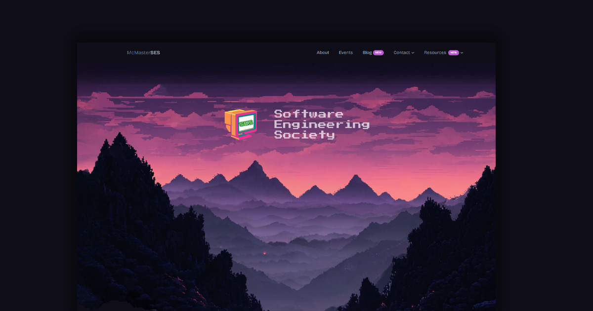

[![Contributors][contributors-shield]][contributors-url]
[![Stargazers][stars-shield]][stars-url]
[![Issues][issues-shield]][issues-url]
[![LinkedIn][linkedin-shield]][linkedin-url]

<!-- PROJECT LOGO -->
 

  

<h3 align="center">SES Website</h3>

  

    The official website for the McMaster Software Engineering Society.
     
    <a href="https://github.com/McMaster-Software-Engineering-Society/SES-Website/wiki"><strong>Explore the docs »</strong></a>
     
     
    <a href="https://ses-website.netlify.app/">View the Website</a>
    ·
    <a href="https://github.com/McMaster-Software-Engineering-Society/SES-Website/issues/new?labels=bug&template=bug-report---.md">Report Bug</a>
    ·
    <a href="https://github.com/McMaster-Software-Engineering-Society/SES-Website/issues/new?labels=enhancement&template=feature-request---.md">Request Feature</a>
  

<!-- TABLE OF CONTENTS -->

  
Table of Contents

  <ol>
    <li>
      <a href="#about-the-project">About The Project</a>
      <ul>
        <li><a href="#built-with">Built With</a></li>
      </ul>
    </li>
    <li>
      <a href="#getting-started">Getting Started</a>
    </li>
    <li><a href="#roadmap">Roadmap</a></li>
    <li><a href="#contributing">Contributing</a></li>
    <li><a href="#contact">Contact</a></li>
  </ol>

<!-- ABOUT THE PROJECT -->

## About The Project

[![Product Name Screen Shot][product-screenshot]](https://example.com)

The McMaster Software Engineering Society (SES) website is a platform for students to learn about the society, its events, and its members. It holds useful resources for all student of Software Engineering to easily access.

### Built With

- [![Astro][Astro.js]][Astro-url]
- [![React][React.js]][React-url]
- [![NextUI][NextUI-badge]][NextUI-url]
- [![TailwindCSS][TailwindCSS]][TailwindCSS-url]

<!-- GETTING STARTED -->

## Getting Started

Visit our Wiki page [here](https://github.com/McMaster-Software-Engineering-Society/SES-Website/wiki/Installation-&-Deployment) for more information on how to install and deploy the website.

<!-- ROADMAP -->

## Roadmap

See the [open issues](https://github.com/McMaster-Software-Engineering-Society/SES-Website/issues) for a full list of proposed features (and known issues).

<!-- CONTRIBUTING -->

## Contributing

If you have a suggestion that would make this better, please submit them to our Google Form [here (coming soon!)](https://forms.gle/)

Interested in contributing to the project? Apply to join the website volunteer team! More information can be found on our Instagram page [@mcmaster_ses](https://www.instagram.com/mcmaster_ses/)

<!-- CONTACT -->

## Contact

McMaster Software Engineering Society - [@mcmaster_ses](https://www.instagram.com/mcmaster_ses/) - macsoftwareengsociety@gmail.com

Project Link: [https://github.com/McMaster-Software-Engineering-Society/SES-Website](https://github.com/McMaster-Software-Engineering-Society/SES-Website)

<!-- MARKDOWN LINKS & IMAGES -->
<!-- https://www.markdownguide.org/basic-syntax/#reference-style-links -->

[contributors-shield]: https://img.shields.io/github/contributors/McMaster-Software-Engineering-Society/SES-Website.svg?style=for-the-badge
[contributors-url]: https://github.com/McMaster-Software-Engineering-Society/SES-Website/graphs/contributors
[forks-shield]: https://img.shields.io/github/forks/McMaster-Software-Engineering-Society/SES-Website.svg?style=for-the-badge
[forks-url]: https://github.com/McMaster-Software-Engineering-Society/SES-Website/network/members
[stars-shield]: https://img.shields.io/github/stars/McMaster-Software-Engineering-Society/SES-Website.svg?style=for-the-badge
[stars-url]: https://github.com/McMaster-Software-Engineering-Society/SES-Website/stargazers
[issues-shield]: https://img.shields.io/github/issues/McMaster-Software-Engineering-Society/SES-Website.svg?style=for-the-badge
[issues-url]: https://github.com/McMaster-Software-Engineering-Society/SES-Website/issues
[linkedin-shield]: https://img.shields.io/badge/-LinkedIn-black.svg?style=for-the-badge&logo=linkedin&colorB=555
[linkedin-url]: https://linkedin.com/in/software-engineering-society
[product-screenshot]: images/screenshot.png
[Next.js]: https://img.shields.io/badge/next.js-000000?style=for-the-badge&logo=nextdotjs&logoColor=white
[Next-url]: https://nextjs.org/
[React.js]: https://img.shields.io/badge/React-20232A?style=for-the-badge&logo=react&logoColor=61DAFB
[React-url]: https://reactjs.org/
[Astro.js]: https://img.shields.io/badge/Astro-000000?style=for-the-badge&logo=astro&logoColor=white
[Astro-url]: https://astro.build/
[Vue.js]: https://img.shields.io/badge/Vue.js-35495E?style=for-the-badge&logo=vuedotjs&logoColor=4FC08D
[Vue-url]: https://vuejs.org/
[Angular.io]: https://img.shields.io/badge/Angular-DD0031?style=for-the-badge&logo=angular&logoColor=white
[Angular-url]: https://angular.io/
[Svelte.dev]: https://img.shields.io/badge/Svelte-4A4A55?style=for-the-badge&logo=svelte&logoColor=FF3E00
[Svelte-url]: https://svelte.dev/
[Laravel.com]: https://img.shields.io/badge/Laravel-FF2D20?style=for-the-badge&logo=laravel&logoColor=white
[Laravel-url]: https://laravel.com
[Bootstrap.com]: https://img.shields.io/badge/Bootstrap-563D7C?style=for-the-badge&logo=bootstrap&logoColor=white
[Bootstrap-url]: https://getbootstrap.com
[JQuery.com]: https://img.shields.io/badge/jQuery-0769AD?style=for-the-badge&logo=jquery&logoColor=white
[JQuery-url]: https://jquery.com
[NextUI-url]: https://nextui.org/
[TailwindCSS-url]: https://tailwindcss.com/
[TailwindCSS]: https://img.shields.io/badge/TailwindCSS-38B2AC?style=for-the-badge&logo=tailwind-css&logoColor=white
[NextUI-badge]: https://img.shields.io/badge/NextUI-000000?style=for-the-badge&logo=nextdotjs&logoColor=white
